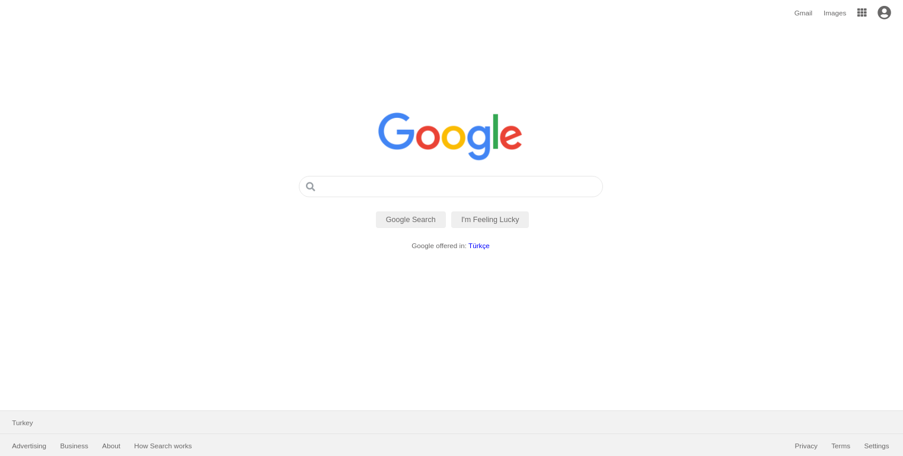

# GOOGLE HOME PAGE

Clone of google home page

## Built With

- MHTML
- CSS

## Live Demo

[Live Demo Link](https://ahmetbozaci.github.io/odin-project-google_home_page/)

## Authors

👤 **Ahmet Bozacı**
- Github:[ahmtbozaci](https://github.com/ahmetbozaci)
- Twitter:[ahmtbozaci](https://twitter.com/ahmtbozaci)
- LinkedIn:[ahmtbozaci](https://www.linkedin.com/in/ahmetbozaci/)

## 🤝 Contributing

Contributions, issues, and feature requests are welcome!

Feel free to check the [issues page](../../issues/).

## Show your support

Give a ⭐️ if you like this project!

## Acknowledgments

- Hat tip to anyone whose code was used
- Inspiration
- etc

## 📝 License

This project is [MIT](./LICENCE) licensed.

